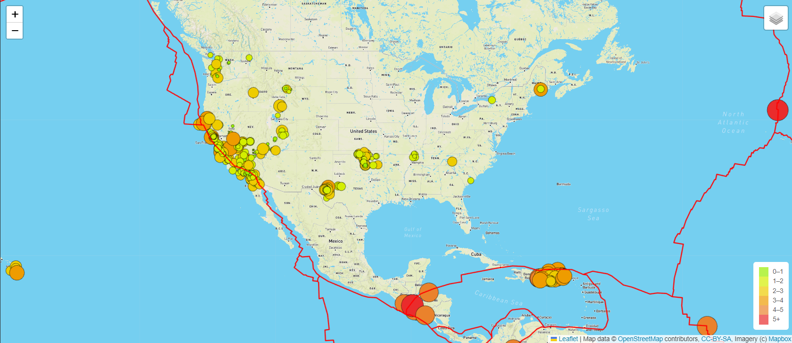
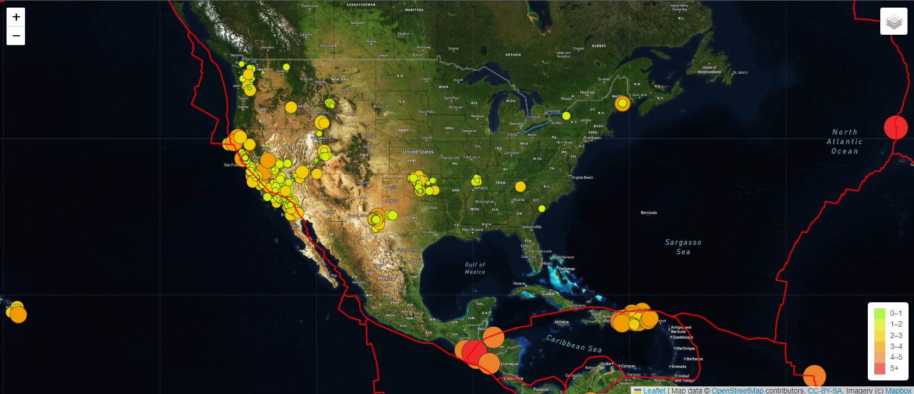
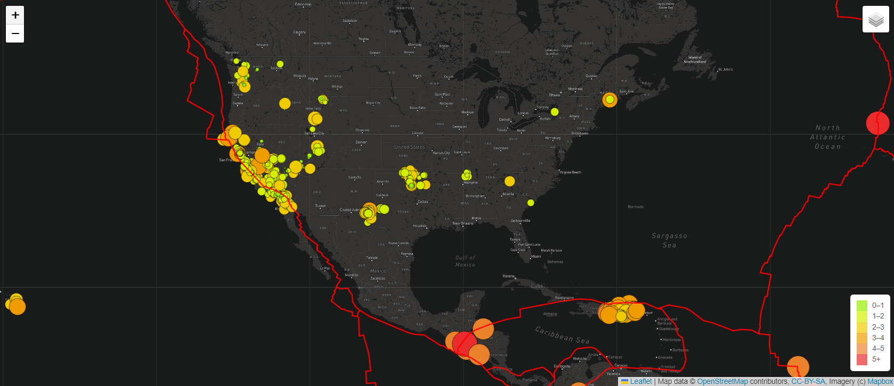
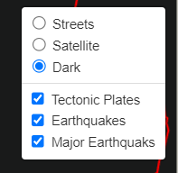

# Mapping_Earthquakes

## Overview
The purpose of this repository is to shown earthquake data using leaflet maps. The final code is in "earthquake_challenge" and the page displays the earthquake data by pulling from a JSON files. It also displays the tectonic plates to see how the plates interact to form the earthquakes.

The map is split into 3 layers. Standard, Satellite, and Dark.

In addition, there are 3 overlays which displays the tectonic plates, all earthquakes, and major earthquakes (>4.5 in magnitude).

